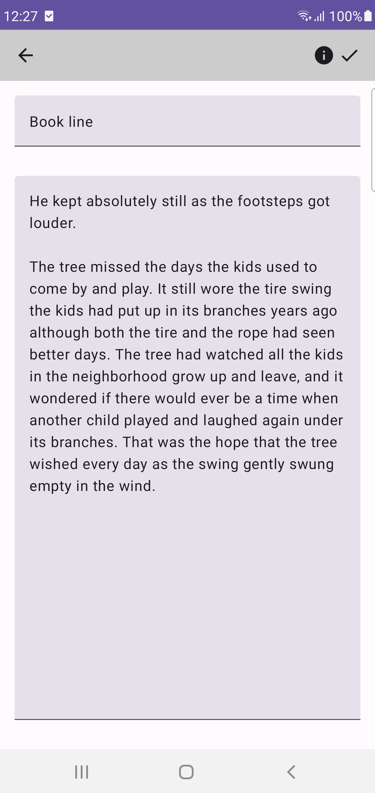
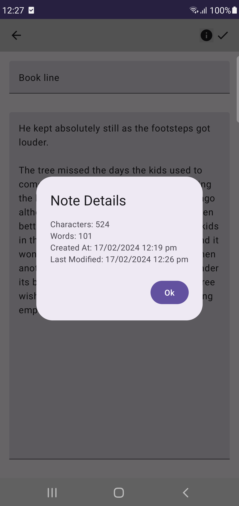

# Quick Note
A simple note taking app for android

## Demo Video

https://github.com/user-attachments/assets/4e8816b1-c041-48ae-a8f7-3b9cafa94f22

## Preview Screenshots
Note Detail Screen

Main / All Notes Screen

Main / All Notes Screen with a particular notebook selected

Note Info Alert Box

Note Delete Alert Box

Assign Note to Notebook

Notebooks Screen

Notebook Edit or Delete

